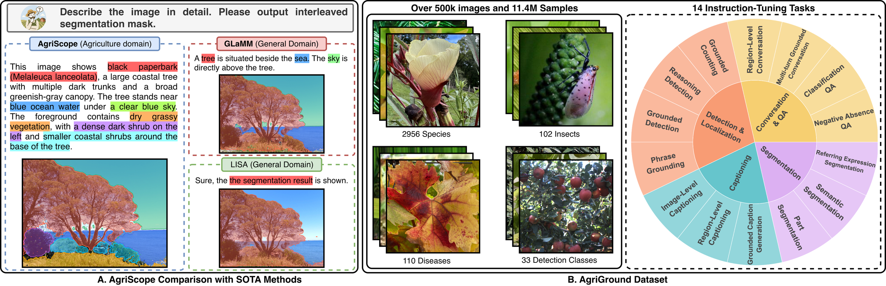
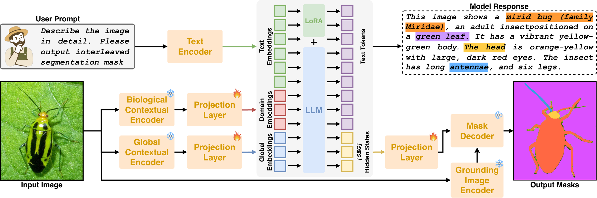
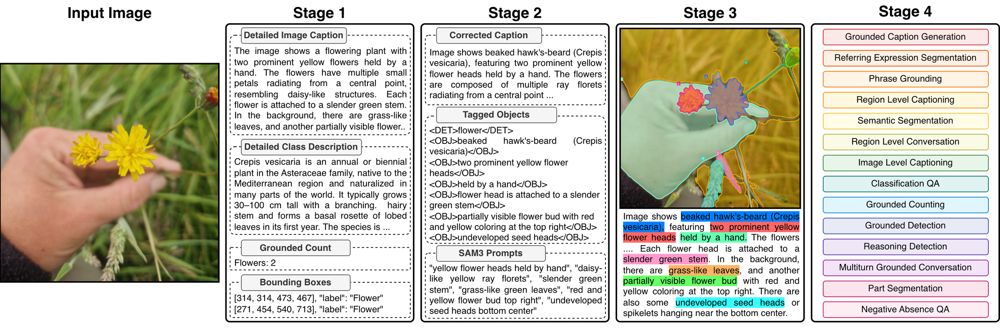
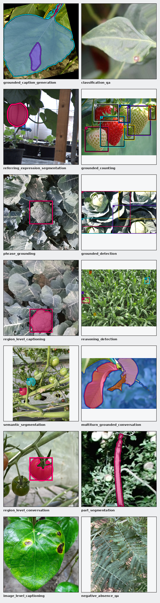
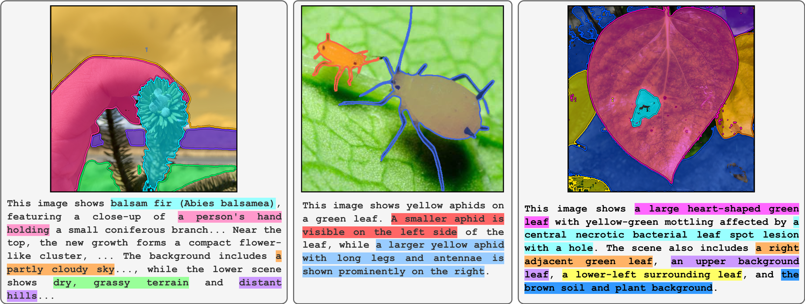
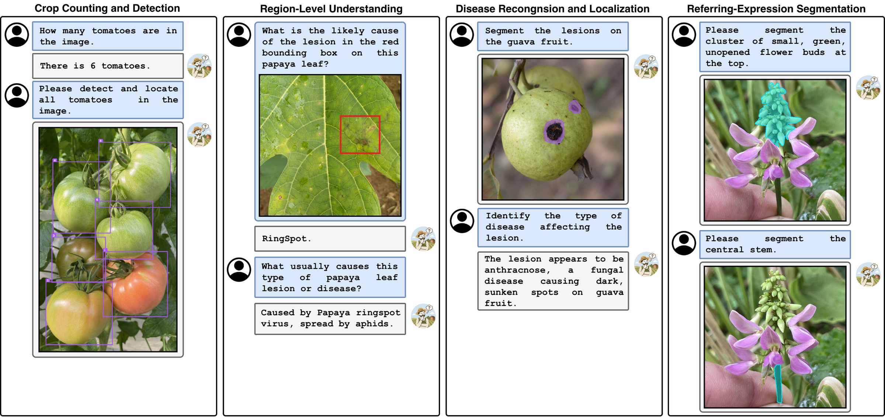
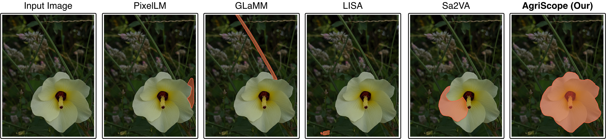

# AgriScope: Pixel-Grounded Multimodal Understanding for Agriculture Images

<p align="center">
  <strong>Abderrahmene Boudiaf, Mohamad Alanssari, Irfan Hussain, Sajid Javed</strong><br>
  Khalifa University of Science and Technology, Abu Dhabi, UAE
</p>

<p align="center">
  A unified multimodal framework for image-level, region-level, and pixel-level understanding of agricultural imagery.
</p>

<p align="center">
  
  
  
  
</p>

> This repository is being prepared for public release. The manuscript figures and project documentation are available now; the paper, code, AgriGround annotations, and model weights will be released separately.

---

## Latest Updates

- **[2026-07-17]** Initial AgriScope repository and project documentation released.

---

## Overview

<p align="center">
  
</p>

**AgriScope** is a pixel-grounded multimodal model designed for agricultural image understanding. Unlike text-only agricultural MLLMs, AgriScope connects generated concepts to visual evidence through segmentation masks and spatial annotations. A single model supports natural-language interaction across image-level descriptions, region-level reasoning, object localization, and pixel-level segmentation.

AgriScope combines biologically informed semantic features with dense spatial representations and language-conditioned mask decoding. The model can identify and describe agricultural entities while grounding plant diseases, lesions, pests, crops, weeds, plant organs, and botanical structures in the input image.

The model is trained with **AgriGround**, a large-scale pixel-grounded agricultural instruction-tuning dataset containing **503,919 images** and **11,421,148 samples** across **14 tasks**.

### Key Contributions

1. **Unified pixel-grounded agricultural understanding:** AgriScope jointly produces text, segmentation masks, and spatial grounding for image-, region-, and pixel-level tasks.
2. **Complementary visual representations:** A biological semantic encoder and a dense contextual encoder capture both agricultural identity and fine spatial structure.
3. **AgriGround dataset:** More than 11.4M instruction-following samples spanning diseases, botanical species, insects, crops, weeds, counting, detection, captioning, and segmentation.
4. **Scalable grounded annotation:** A four-stage pipeline aligns detailed captions, object phrases, bounding boxes, and segmentation masks before synthesizing task-specific instructions.

---

## AgriScope Model

<p align="center">
  
</p>

AgriScope uses a dual-encoder architecture to preserve both domain semantics and localization detail:

| Component | Role |
|---|---|
| Biological contextual encoder | Extracts language-aligned biological semantics for species, diseases, pests, and plant structures |
| Global contextual encoder | Preserves dense spatial, morphological, texture, and boundary information |
| Multimodal language model | Fuses image and prompt embeddings and generates text together with special `[SEG]` tokens |
| Grounding projection | Maps each `[SEG]` hidden state into the mask-conditioning space |
| SAM2-driven decoder | Produces a pixel-level mask aligned with each grounded phrase |

The manuscript implementation initializes the visual and grounding components from BioCLIP, DINOv3, and SAM2. Training first aligns the visual-language projections and grounding modules, then applies parameter-efficient LoRA instruction tuning while keeping the large pretrained encoders frozen.

### Supported Outputs

- Natural-language captions and answers
- Interleaved grounded captions with phrase-mask correspondence
- Referring-expression and semantic segmentation masks
- Region-conditioned descriptions and conversations
- Object counts and normalized bounding boxes
- Multi-turn grounded interactions

---

## AgriGround Dataset

<p align="center">
  
</p>

AgriGround is constructed through a four-stage annotation and task-generation pipeline:

1. Generate detailed image captions, class descriptions, counts, and bounding-box metadata.
2. Correct captions, identify grounded object phrases, and prepare segmentation prompts.
3. Generate and align segmentation masks with the grounded phrases.
4. Synthesize instruction-following records for the 14 supported tasks.

### Dataset Statistics

| Split | Images | Samples | Average samples/image |
|---|---:|---:|---:|
| Train | 401,234 | 9,095,320 | 22.66 |
| Test | 102,685 | 2,325,828 | 22.66 |
| **Total** | **503,919** | **11,421,148** | **22.66** |

| Source group | Images | Share |
|---|---:|---:|
| Classification datasets | 232,923 | 46.22% |
| Detection datasets | 27,938 | 5.54% |
| iNatAg subset | 169,324 | 33.60% |
| Insects (IP102) | 73,734 | 14.63% |

### Fourteen Tasks

AgriGround covers four complementary task families:

| Family | Tasks |
|---|---|
| Captioning | Image-level captioning, region-level captioning, grounded caption generation |
| Segmentation | Referring expression segmentation, semantic segmentation, part segmentation |
| Detection and localization | Phrase grounding, grounded counting, grounded detection, reasoning detection |
| Conversation and QA | Region-level conversation, multi-turn grounded conversation, classification QA, negative absence QA |

<p align="center">
  
</p>

Detailed task definitions and sample counts are available in [docs/TASKS.md](docs/TASKS.md).

### Release Status

| Resource | Status |
|---|---|
| Train/test annotations | **Coming soon** |
| Source dataset preparation guide | **Coming soon** |
| Annotation pipeline | **Coming soon** |
| Dataset license and terms | **Coming soon** |

The source agricultural images are not currently distributed through this repository. Their original licenses and terms remain applicable.

---

## Qualitative Results

### Grounded Caption Generation

AgriScope produces detailed descriptions while associating each highlighted phrase with its corresponding segmentation mask.

<p align="center">
  
</p>

### Representative Agricultural Tasks

<p align="center">
  
</p>

### Referring Expression Segmentation

<p align="center">
  
</p>

---

## Performance Summary

The following values are reported in the current manuscript draft.

| Task | Metrics | AgriScope |
|---|---|---:|
| Image-level captioning | CIDEr / ASF | **146.4 / 86.7** |
| Region-level captioning | CIDEr / ASF | **132.5 / 84.8** |
| Classification QA | Accuracy / F1 | **82.4 / 80.7** |
| Grounded counting | Accuracy | **74.8** |
| Semantic segmentation | mIoU / Dice | **66.1 / 78.4** |
| Referring expression segmentation | J&F / cIoU | **67.30 / 72.65** |
| Grounded caption generation | METEOR / CIDEr | **27.9 / 118.6** |
| Grounded caption generation | AP50 / mIoU / Recall | **63.9 / 59.4 / 74.2** |

### Efficiency

| Parameters | GFLOPs | GPU memory | Inference time |
|---:|---:|---:|---:|
| **2B** | **177** | **6 GB** | **480 ms/image** |

Full evaluation tables, experimental settings, and cross-dataset results will accompany the paper release.

---

## Installation and Inference

Training and inference code is **coming soon**. The public release will include:

- Environment and dependency specifications
- Model and adapter download instructions
- Single-image inference
- Multi-turn grounded interaction
- Training and evaluation entry points
- AgriGround annotation preparation

---

## Citation

The paper link and final citation will be added upon release. Until then, please use:

```bibtex
@misc{boudiaf2026agriscope,
  title  = {AgriScope: Pixel-Grounded Multimodal Understanding for Agriculture Images},
  author = {Boudiaf, Abderrahmene and Alanssari, Mohamad and Hussain, Irfan and Javed, Sajid},
  year   = {2026},
  note   = {Manuscript under review}
}
```

---

## License

The repository documentation and future code release are provided under the [Apache License 2.0](LICENSE). Dataset annotations and source images may be subject to separate terms, which will be documented with the dataset release.

## Acknowledgments

This work was conducted at Khalifa University of Science and Technology, Abu Dhabi, UAE. We acknowledge the creators and maintainers of the agricultural datasets and open-source foundation models that support this research.

## Contact

For questions and collaborations, please open a [GitHub issue](https://github.com/boudiafA/AgriScope/issues).
